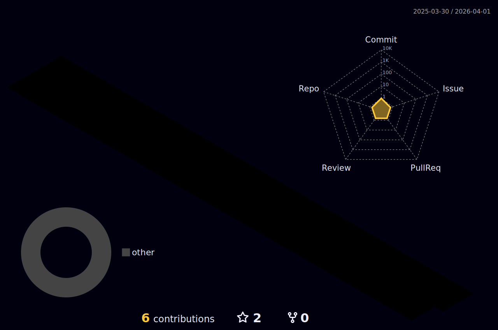

### Hi there 👋
I am senior grade of mathematical engineering at YTU. I am currently improving myself in AI. 
- 💬 Ask me about AI, ML, Python, or any topics
- 📫 How to reach me: eminecansuakgul@gmail.com

## 🌐 Socials:
  

# 💻 Tech Stack:
              
# 📊 GitHub Stats:
 
 

### 🔝 Top Contributed Repo

---

<!-- Proudly created with GPRM ( https://gprm.itsvg.in ) -->
